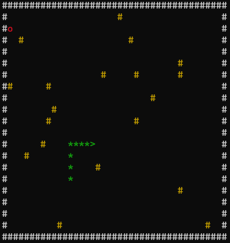

## 📝 معرفی
یک بازی کامل توپ با قابلیت‌های پیشرفته شامل دیوار آجری، سیستم امتیازدهی، ذخیره رکوردها و منوی کامل.

## ✨ ویژگی‌ها
- 🐍 **حرکت مار** - حرکت به ضورت بالا, پایین, چپ و راست
- 🧱 **دیوار تصادفی** - قرار گرفتن 10 تا 20 دیوار تصادفی حین بازی و تغیرر بعد لول آپ شدن
- 🍎 **سیب تصادفی** - قرار گرفتن سیب تصادفی در بازی
- 💚 **سیستم جان** - ۳ جان برای بازی
- 🏆 **امتیازدهی** - خوردن سیب -10- امتیاز
- 📊 **ذخیره رکورد** - ذخیره خودکار با اسم بازیکن
- 🔊 **صدای برخورد** - افکت صوتی با Beep
- ⚡ **افزایش سرعت** - هر ۱۰ امتیاز، سرعت توپ بیشتر می‌شه
- 🎮 **منوی کامل** - شروع، راهنما، رکوردها، خروج

## 🚀 نحوه اجرا


### با Makefile (پیشنهادی)
```powershell```
- mingw32-make help        

### با build.bat
```cmd || powershell```
- ./build.bat

### با run code manual
```cmd```
- g++ -std=c++17 utils.cpp snake.cpp segment.cpp recordScoreByName.cpp randomBrick.cpp manageScore.cpp game.cpp food.cpp main.cpp -o snake.exe -lwinmm

# pongOnePerson-game/
- ├── include/------------------/* فایل‌های هدر 
- │   ├── food.h
- │   ├── snake.h
- │   ├── randomBrick.h
- │   ├── segment.h
- │   ├── game.h
- │   ├── utils.h
- │   ├── recordScore.h
- │   └── manageScore.h
- ├── src/----------------------/*فایل‌های منبع
- │   ├── main.cpp
- │   ├── food.cpp
- │   ├── snake.cpp
- │   ├── randomBrick.cpp
- │   ├── segment.cpp
- │   ├── game.cpp
- │   ├── utils.cpp
- │   ├── recordScore.cpp----- -/* ساختار داده 
- │   ├── manageScore.cpp-------/* فایل‌های داده 
- │   └──── data/--------------/* برای ذخیره رکوردها که با بازی کردن بازی خودش اتوماتیک درست میشه
- │         └──data.txt
- │
- ├── image.png
- ├── build.bat   
- ├── Makefile
- └── README.md-----------------/* مستندات 


